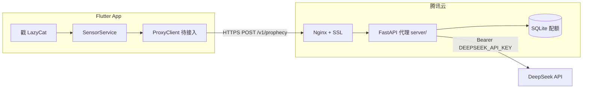

# DeepSeek 代理架构与腾讯云部署指南

**文档类型**：技术架构 + 运维部署  
**适用版本**：废话预言家 1.0.0+（`server/` MVP 后端）  
**更新日期**：2026-06-07

---

## 1. 背景与目标

当前 Flutter 客户端在 `DeepSeekConfig.builtInApiKey` 中内置 API Key，存在反编译提取与滥用风险。本地 `DeepSeekUsageTracker` 仅做设备端 50 次/日限额，可被重装或改时区绕过。

**代理服务目标**：

- API Key **仅存放在服务端**环境变量
- 按 `device_id` 在 **SQLite** 做每日配额（默认 50 次，自然日 `Asia/Shanghai`）
- 复用客户端已有的 **ProphecyPromptBuilder** 与质量门逻辑
- 为后续 Flutter 改造提供稳定 HTTPS 端点

---

## 2. 系统架构



### 组件职责

| 组件 | 职责 |
|------|------|
| Flutter 客户端 | 采集传感器、展示预言；携带 `device_id` 调用代理 |
| Nginx | TLS 终结、反向代理、限流（可选） |
| FastAPI (`server/`) | 鉴权配额、构建 prompt、调用 DeepSeek、清洗输出 |
| SQLite | `daily_usage(device_id, date, count)` 表，按自然日计数 |
| DeepSeek | `deepseek-chat` Chat Completions |

### 与客户端逻辑对应关系

| Flutter | 服务端 (`server/app/services/`) |
|---------|--------------------------------|
| `prophecy_prompt_builder.dart` | `prophecy_prompt_builder.py` |
| `prophecy_normalizer.dart` | `prophecy_normalizer.py` |
| `deepseek_client.dart` | `deepseek_client.py` |
| `deepseek_usage_tracker.dart` | `quota_service.py`（SQLite 替代 SharedPreferences） |
| `SensorData` | `models/sensor.py` |

---

## 3. API 设计

基础 URL 示例：`https://api.yourdomain.com`

### 3.1 `GET /health`

健康检查，供负载均衡与监控使用。

```json
{
  "status": "ok",
  "deepseek_configured": true,
  "storage_ok": true
}
```

### 3.2 `POST /v1/prophecy`

生成一条预言，**成功时消耗 1 次配额**。

**请求体**：

```json
{
  "device_id": "550e8400-e29b-41d4-a716-446655440000",
  "nonce": 42,
  "sensor": {
    "battery": 68,
    "brightness": 60,
    "volume": 25,
    "steps": 3200,
    "is_moving": true,
    "ambient_light": 180,
    "is_real_ambient_light": false,
    "is_estimated_ambient_light": true,
    "day_phase": "下午",
    "time_hint": "下午摸鱼中"
  }
}
```

**响应 `200`**：

```json
{
  "prophecy": "步数破3k时，你划过的下一条视频会讲一只猫的名字",
  "engine": "deepseek",
  "quota_used": 12,
  "quota_remaining": 38,
  "daily_limit": 50
}
```

**错误码**：

| HTTP | 含义 |
|------|------|
| `429` | 当日配额用尽 |
| `502` | DeepSeek 调用失败或输出不合格 |
| `503` | 服务端未配置 `DEEPSEEK_API_KEY` 或 SQLite 不可用 |

### 3.3 `GET /v1/quota?device_id=...`

查询当日用量，不消耗配额。

```json
{
  "device_id": "550e8400-e29b-41d4-a716-446655440000",
  "daily_limit": 50,
  "used": 12,
  "remaining": 38,
  "date": "2026-06-07",
  "timezone": "Asia/Shanghai"
}
```

### 3.4 `POST /v1/register`（可选）

为客户端分配或确认 `device_id`。若设置环境变量 `REGISTER_API_KEY`，需在 Header 携带 `Authorization: Bearer <token>`。

```json
{ "device_id": null }
```

响应：

```json
{
  "device_id": "新生成的-uuid",
  "registered_at": "2026-06-07T08:00:00Z"
}
```

---

## 4. 配额与 SQLite 表设计

- **表名**：`daily_usage(device_id, date, count)`，主键 `(device_id, date)`
- **date**：`QUOTA_TIMEZONE`（默认 `Asia/Shanghai`）下的 `YYYY-MM-DD`
- **上限**：`DAILY_LIMIT`（默认 `50`）
- **计数时机**：仅 DeepSeek **成功返回**后调用 `record_success()` 递增；失败不扣配额
- **预检**：请求前 `ensure_available()` 检查，避免无配额时仍调用 DeepSeek
- **持久化**：Docker 卷挂载 `/data/quota.db`（环境变量 `SQLITE_PATH` 或 `DATA_DIR`）

MVP 单机流量下 SQLite WAL 模式足够；无需额外 Redis 服务。

---

## 5. 环境变量

| 变量 | 必填 | 说明 |
|------|------|------|
| `DEEPSEEK_API_KEY` | 是 | DeepSeek API 密钥，**仅服务端** |
| `SQLITE_PATH` | 否 | 默认 `./data/quota.db`；Docker 推荐 `/data/quota.db` |
| `DATA_DIR` | 否 | 指定目录时使用 `{DATA_DIR}/quota.db` |
| `DAILY_LIMIT` | 否 | 默认 `50` |
| `QUOTA_TIMEZONE` | 否 | 默认 `Asia/Shanghai` |
| `DEEPSEEK_API_BASE` | 否 | 默认 `https://api.deepseek.com` |
| `DEEPSEEK_MODEL` | 否 | 默认 `deepseek-chat` |
| `REGISTER_API_KEY` | 否 | 保护注册接口 |

`.env` 文件权限：`chmod 600 .env`，**勿提交 Git**。

---

## 6. 本地开发

```bash
cd server
cp .env.example .env
# 编辑 DEEPSEEK_API_KEY

docker compose up -d --build   # app + SQLite 卷
curl http://localhost:8000/health
```

生产 compose（映射 80:8000，适合 IP 直连）：

```bash
docker compose -f docker-compose.prod.yml up -d --build
```

IP 部署逐步说明见 [`server/deploy/DEPLOY_IP.md`](../server/deploy/DEPLOY_IP.md)。

---

## 7. 腾讯云部署指南

### 7.1 推荐产品选型

| 场景 | 推荐 | 规格建议 |
|------|------|----------|
| MVP 单机 | **轻量应用服务器 Lighthouse** | 2 核 2G、Ubuntu 22.04 |
| 需更多扩展 | **云服务器 CVM** | 2 核 4G 起 |
| 配额存储 | **SQLite 文件**（Docker 卷 `/data`） | 单机 MVP 足够 |
| 域名 HTTPS | Nginx + **Let's Encrypt** 或 **腾讯云 SSL 证书（免费）** | — |

**地域**：广州 / 上海 / 新加坡，选离主要用户最近的节点。

**为何选腾讯云而非 Fly.io**：

- 国内用户访问延迟更低，无需跨境链路
- 与国内域名 **ICP 备案**流程配套
- 团队对腾讯云控制台、监控、账单更熟悉
- Fly.io 适合全球边缘部署，但对「大陆用户 + 备案域名」场景不如国内云直观

### 7.2 部署步骤

#### 步骤 1：购买轻量服务器

1. 登录 [腾讯云控制台](https://console.cloud.tencent.com/)
2. 轻量应用服务器 → 创建实例
3. 镜像：**Ubuntu 22.04 LTS**
4. 套餐：**2核2G**（MVP 足够）
5. 记录公网 IP

#### 步骤 2：配置安全组

| 端口 | 协议 | 来源 | 说明 |
|------|------|------|------|
| 22 | TCP | 你的办公 IP /32 | SSH，勿对 `0.0.0.0/0` 全开 |
| 80 | TCP | 0.0.0.0/0 | HTTP（证书验证 + 跳转 HTTPS） |
| 443 | TCP | 0.0.0.0/0 | HTTPS |

**MVP（IP 直连）**：`docker-compose.prod.yml` 映射 `80:8000`，可直接通过公网 IP 访问。  
**域名 + HTTPS**：应用容器监听 `127.0.0.1:8000`，由 Nginx 终结 TLS 并反代。

#### 步骤 3：安装 Docker 与 Docker Compose

SSH 登录服务器后：

```bash
sudo apt-get update
sudo apt-get install -y ca-certificates curl gnupg
sudo install -m 0755 -d /etc/apt/keyrings
curl -fsSL https://download.docker.com/linux/ubuntu/gpg | sudo gpg --dearmor -o /etc/apt/keyrings/docker.gpg
echo \
  "deb [arch=$(dpkg --print-architecture) signed-by=/etc/apt/keyrings/docker.gpg] https://download.docker.com/linux/ubuntu \
  $(. /etc/os-release && echo "$VERSION_CODENAME") stable" | \
  sudo tee /etc/apt/sources.list.d/docker.list > /dev/null
sudo apt-get update
sudo apt-get install -y docker-ce docker-ce-cli containerd.io docker-compose-plugin
sudo usermod -aG docker $USER
# 重新登录 shell 使 docker 组生效
```

#### 步骤 4：部署应用

```bash
# 在服务器上
sudo mkdir -p /opt/nonsense-prophet-proxy
sudo chown $USER:$USER /opt/nonsense-prophet-proxy
cd /opt/nonsense-prophet-proxy

# 上传 server/ 目录（git clone、scp 或 CI 均可）
git clone <你的仓库> .   # 或只拷贝 server/

cd server
cp .env.example .env
chmod 600 .env
nano .env   # 填入 DEEPSEEK_API_KEY（SQLITE_PATH 由 compose 默认设置）

docker compose -f docker-compose.prod.yml up -d --build
curl http://127.0.0.1/health          # MVP：80 映射
# 或 curl http://<公网IP>/health
```

更新部署：

```bash
cd /opt/nonsense-prophet-proxy/server
git pull
docker compose -f docker-compose.prod.yml build --pull
docker compose -f docker-compose.prod.yml up -d
```

#### 步骤 5：Nginx 反向代理 + SSL（有域名时）

安装 Nginx 与 Certbot（Let's Encrypt）：

```bash
sudo apt-get install -y nginx certbot python3-certbot-nginx
```

`/etc/nginx/sites-available/prophecy-proxy` 示例：

```nginx
server {
    listen 80;
    server_name api.yourdomain.com;

    location / {
        proxy_pass http://127.0.0.1:8000;
        proxy_set_header Host $host;
        proxy_set_header X-Real-IP $remote_addr;
        proxy_set_header X-Forwarded-For $proxy_add_x_forwarded_for;
        proxy_set_header X-Forwarded-Proto $scheme;
    }
}
```

```bash
sudo ln -s /etc/nginx/sites-available/prophecy-proxy /etc/nginx/sites-enabled/
sudo nginx -t && sudo systemctl reload nginx
sudo certbot --nginx -d api.yourdomain.com
```

也可在腾讯云 SSL 证书服务申请 **免费 DV 证书**，下载 Nginx 格式后手动配置 `ssl_certificate`。

#### 步骤 6：域名与 ICP 备案

- **大陆自定义域名**指向腾讯云大陆节点：需完成 **ICP 备案**（通常 1–3 周）
- **未备案**：可先用服务器 IP + 自签证书做内测；或使用已备案域名子域
- **海外地域**（如新加坡）：大陆访问可能较慢，且域名备案要求不同，按业务选择

#### 步骤 7：密钥与配置安全

```bash
chmod 600 /opt/nonsense-prophet-proxy/server/.env
# 确认 .env 在 .gitignore 中
# 定期在 DeepSeek 控制台轮换 API Key
```

#### 步骤 8：DeepSeek API Key

1. 在 [DeepSeek 开放平台](https://platform.deepseek.com/) 创建 Key
2. 仅写入服务器 `.env` 的 `DEEPSEEK_API_KEY`
3. 设置用量告警，防止异常账单

#### 步骤 9：监控与日志

| 能力 | 方案 |
|------|------|
| 主机监控 | 腾讯云轻量/CVM 自带 CPU、内存、带宽监控 |
| 进程存活 | `docker ps`、cron 检查 `/health` |
| 应用日志 | `docker compose logs -f app` |
| 告警 | 腾讯云告警策略 → 短信/邮件（CPU > 80%、磁盘不足） |
| 可选 | 接入 CLS 日志服务或 Prometheus |

---

## 8. 成本估算（CNY / 月，仅供参考）

| 项目 | 规格 | 约价 |
|------|------|------|
| 轻量应用服务器 | 2核2G、60M 带宽 | ¥40–65 |
| SQLite 配额 | Docker 卷，含在轻量机内 | ¥0 |
| 域名 | `.com` 新购 | ¥55–75/年（摊销约 ¥5/月） |
| SSL | Let's Encrypt / 腾讯云免费 DV | ¥0 |
| DeepSeek API | 按 token 计费 | 视 DAU，MVP 通常 ¥10–100 |

**MVP 合计**：约 **¥50–70/月**（不含 DeepSeek 用量波动）。

---

## 9. Flutter 客户端改造要点（后续迭代）

> 本次 MVP **不修改客户端**；接入时参考：

1. 新增 `ProxyConfig.baseUrl` 指向 `https://api.yourdomain.com`
2. `DeepSeekClient` 改为调用 `POST /v1/prophecy`，移除内置 Key
3. 首次启动生成/读取持久化 `device_id`，可选调用 `/v1/register`
4. 配额查询改 `GET /v1/quota`；本地 `DeepSeekUsageTracker` 可作缓存展示
5. 代理失败时保持现有 **模板库静默降级**

---

## 10. 安全清单

- [ ] `DEEPSEEK_API_KEY` 仅存在于服务器 `.env`
- [ ] `.env` 权限 `600`，已加入 `.gitignore`
- [ ] SSH 限制来源 IP，考虑密钥登录禁用密码
- [ ] 有 Nginx 时仅 80/443 对公网开放；IP MVP 可直接映射 80:8000
- [ ] SQLite 数据卷定期备份 `quota.db`
- [ ] DeepSeek 控制台设置用量上限与告警
- [ ] 定期 `docker compose pull` 更新基础镜像

---

## 11. 目录结构

```
server/
├── app/
│   ├── main.py              # FastAPI 入口
│   ├── config.py            # 环境变量
│   ├── models/              # Pydantic 模型
│   ├── routers/v1.py        # API 路由
│   └── services/            # prompt、DeepSeek、配额
├── Dockerfile
├── deploy/DEPLOY_IP.md      # IP 直连部署步骤
├── docker-compose.yml       # 本地：app + SQLite 卷
├── docker-compose.prod.yml  # 生产：80:8000 + SQLite 卷
├── tests/                   # pytest
├── requirements.txt
├── .env.example
└── README.md
```

---

*本文档随 `server/` 代码迭代更新。*
